---
## Front matter
title: "Отчёт по лабораторной работе №6"
subtitle: "Дисциплина: Архитектура Компьютера"
author: "Егор Витальевич Кузьмин"

## Generic otions
lang: ru-RU
toc-title: "Содержание"

## Bibliography
bibliography: bib/cite.bib
csl: pandoc/csl/gost-r-7-0-5-2008-numeric.csl

## Pdf output format
toc: true # Table of contents
toc-depth: 2
lof: true # List of figures

fontsize: 12pt
linestretch: 1.5
papersize: a4
documentclass: scrreprt
## I18n polyglossia
polyglossia-lang:
  name: russian
  options:
	- spelling=modern
	- babelshorthands=true
polyglossia-otherlangs:
  name: english
## I18n babel
babel-lang: russian
babel-otherlangs: english
## Fonts
mainfont: PT Serif
romanfont: PT Serif
sansfont: PT Sans
monofont: PT Mono
mainfontoptions: Ligatures=TeX
romanfontoptions: Ligatures=TeX
sansfontoptions: Ligatures=TeX,Scale=MatchLowercase
monofontoptions: Scale=MatchLowercase,Scale=0.9
## Biblatex
biblatex: true
biblio-style: "gost-numeric"
biblatexoptions:
  - parentracker=true
  - backend=biber
  - hyperref=auto
  - language=auto
  - autolang=other*
  - citestyle=gost-numeric
## Pandoc-crossref LaTeX customization
figureTitle: "Рис."
tableTitle: "Таблица"
listingTitle: "Листинг"
lofTitle: "Список иллюстраций"

lolTitle: "Листинги"
## Misc options
indent: true
header-includes:
  - \usepackage{indentfirst}
  - \usepackage{float} # keep figures where there are in the text
  - \floatplacement{figure}{H} # keep figures where there are in the text
---

# Цель работы

Целью данной работы является освоение арифметических инструкций языка ассемблера NASM и приобретение навыков работы с ними.

# Задание

	0. Общее ознакомление с арифметическими инструкциями в NASM.
	1. Символьные и численные данные в NASM.
	2. Выполнение арифметических операций в NASM.
	3. Выполнение заданий для самостоятельной работы
	
# Теоретическое введение

Большинство инструкций на языке ассемблера требуют обработки операндов. Адрес операнда предоставляет место, где хранятся данные, подлежащие обработке. Это могут быть данные хранящиеся в регистре или в ячейке памяти. Далее рассмотрены все существующие способы задания адреса хранения операндов – способы адресации.
Существует три основных способа адресации:
• Регистровая адресация – операнды хранятся в регистрах и в команде используются
имена этих регистров, например: mov ax,bx.
• Непосредственная адресация – значение операнда задается непосредственно в команде, Например: mov ax,2.
• Адресация памяти – операнд задает адрес в памяти. В команде указывается символическое обозначение ячейки памяти, над содержимым которой требуется выполнить операцию.

Ввод информации с клавиатуры и вывод её на экран осуществляется в символьном виде.Кодирование этой информации производится согласно кодовой таблице символов ASCII. ASCII – сокращение от American Standard Code for Information Interchange (Американский стандартный код для обмена информацией). Согласно стандарту ASCII каждый символ кодируется одним байтом. Расширенная таблица ASCII состоит из двух частей. Первая  является универсальной, а вторая предназначена для специальных символов и букв национальных алфавитов и на компьютерах разных типов может меняться. Среди инструкций NASM нет такой, которая выводит числа (не в символьном виде). Поэтому, например, чтобы вывести число, надо предварительно преобразовать его цифры в
ASCII-коды этих цифр и выводить на экран эти коды, а не само число. Если же выводить число на экран непосредственно, то экран воспримет его не как число, а как последовательность ASCII-символов – каждый байт числа будет воспринят как один ASCII-символ – и выведет на экран эти символы. Аналогичная ситуация происходит и при вводе данных с клавиатуры. Введенные данные будут представлять собой символы, что сделает невозможным получение корректного результата при выполнении над ними арифметических операций. Для решения этой проблемы необходимо проводить преобразование ASCII символов в числа и обратно.

# Выполнение лабораторной работы
 
 4.1) Символьные и численные данные в NASM.
 
 С помощью утилиты mkdir создаю директорию lab06 для выполнения соответствующей лабораторной работы. Перехожу в созданный каталог с помощью утилиты cd. С помощью touch создаю файл lab6-1.asm. (рис. @fig:001).

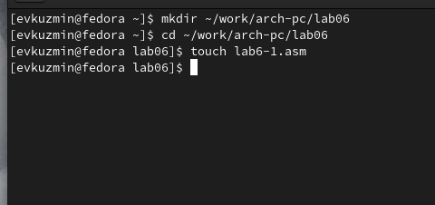{#fig:001 width=70%}

 Копирую в текущий каталог файл in_out.asm с помощью утилиты cp, ибо он будет использоваться в дальнейшем. (рис. @fig:002). 
 
{#fig:002 width=70%}
 
 Открываю созданный файл lab6-1.asm, вставляю в него следующую программу:  (рис. @fig:003).

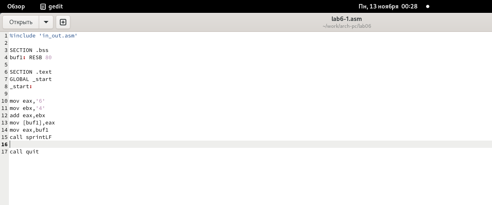{#fig:003 width=70%}

 Выполняю компиляцию, компоновку файла и запускаю его. Программа выводит символ j, потому что он соответствует сумме двоичных кодов символов 4 и 6 по системе ASCII. (рис. @fig:004).
 
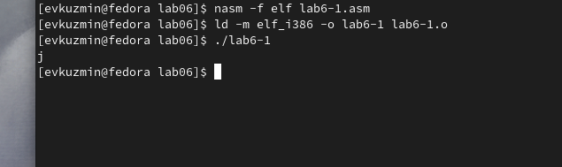{#fig:004 width=70%}
 
 Изменяю в тексте программы символы “6” и “4” на цифры 6 и 4 (рис. @fig:005).

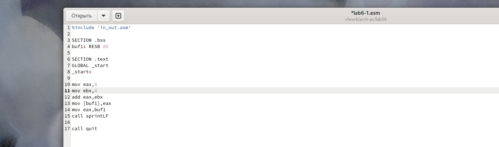{#fig:005 width=70%}
 
 Создаю новый исполняемый файл программы и запускаю его. На экран вывелся символ с кодом 10 и он не отображается, т.к. это символ перевода строки. (рис. @fig:006).
 
{#fig:006 width=70%}

 Создаю новый файл lab6-2.asm с помощью утилиты touch. Открываю файл lab6-2.asm для редактирования, ввожу следующую программу. (рис. @fig:007).

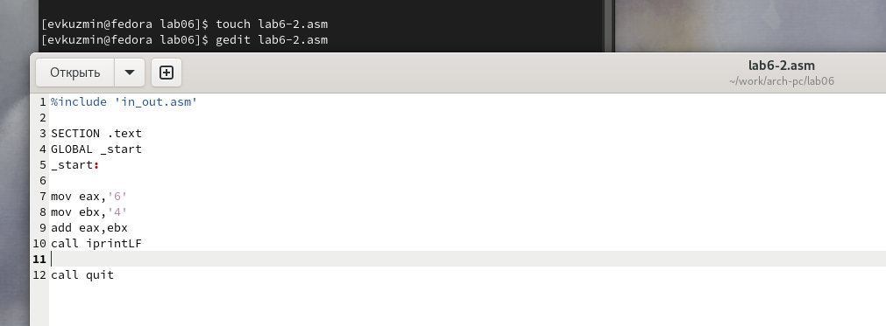{#fig:007 width=70%}

 Выполняю компиляцию и компоновку, и запускаю исполняемый файл lab6-2. Теперь на экран выводится число 106, т.к. происходит сложение кодов символов “6” и “4”, но при этом программа позволяет вывести именно число, а не символ, кодом которого является это число (рис. @fig:008).

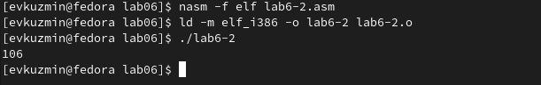{#fig:008 width=70%}
 
 Следом также заменяю в тексте программы в файле lab6-2.asm символы “6” и “4” на числа 6 и 4. Затем провожу компиляцию и компоновку, после этого запускаю исполняемый файл. Теперь программа складывает не соответствующие символам коды в системе ASCII, а сами числа, поэтому на экране мы видим число 10. (рис. @fig:009).
 
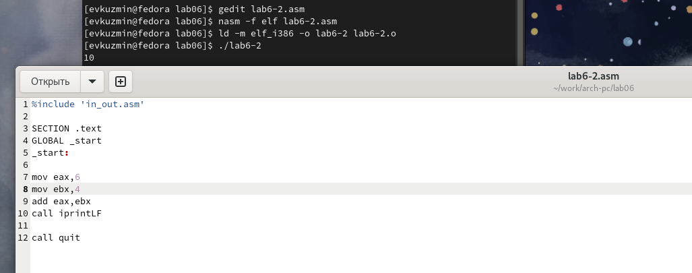{#fig:009 width=70%}

 Заменяю в тексте программы функцию iprintLF на iprint. (рис. @fig:010).
 
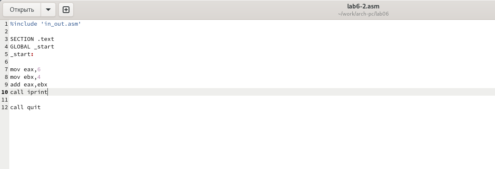{#fig:010 width=70%}

 Проводим с файлом привычные операции. Вывод изменился (см. рисунок), потому что функция iprint не добавляет к выводу символ переноса строки в отличие от функции iprintLF. (рис. @fig:011).

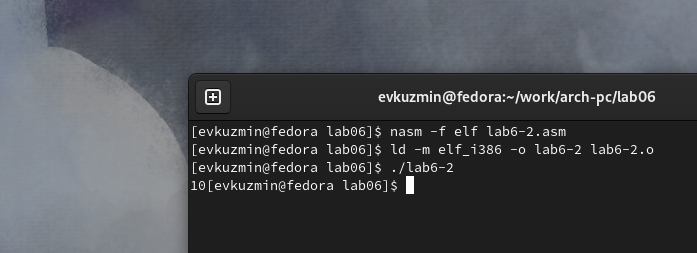{#fig:011 width=70%}

 4.2) Выполнение арифметических операций в NASM.

 Создаю файл lab6-3.asm с помощью утилиты touch. Ввожу в созданный файл текст программы для вычисления значения выражения:
 f(x) = (5*2+3)/3 (рис. @fig:012).
 
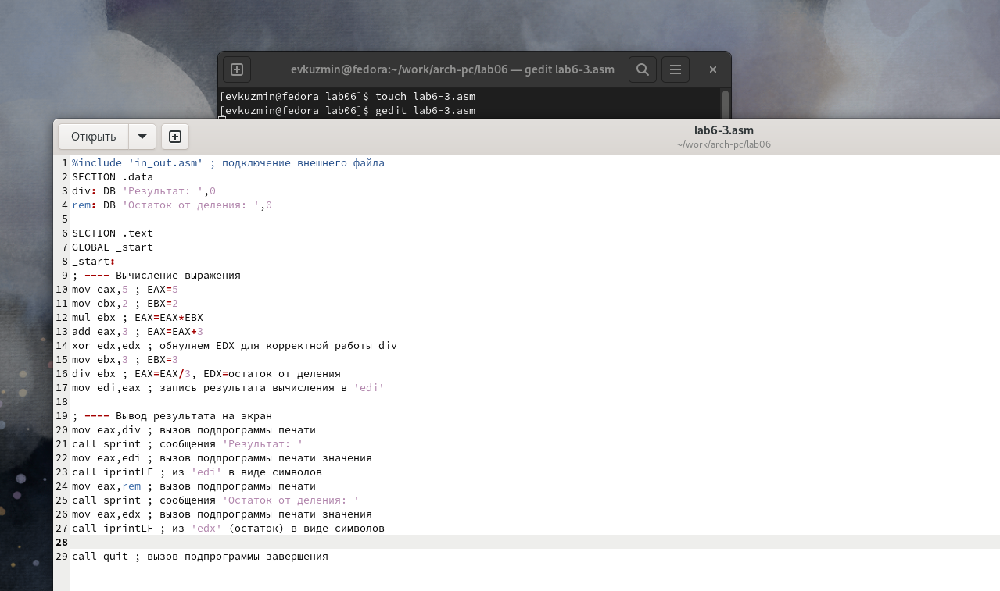{#fig:012 width=70%}

 Реализовываю исполняемый файл и запускаю его (рис. @fig:013).
 
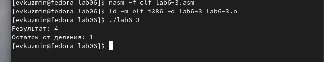{#fig:013 width=70%}

  Изменяю программу так, чтобы она вычисляла значение выражения f(x) = (4*6+2)/5. Выполняю компиляцию и компоновку файла, далее запускаю новый исполняемый файл. Если проведем устную проверку, то убедимся в правильности работы программы. (рис. @fig:014).
  
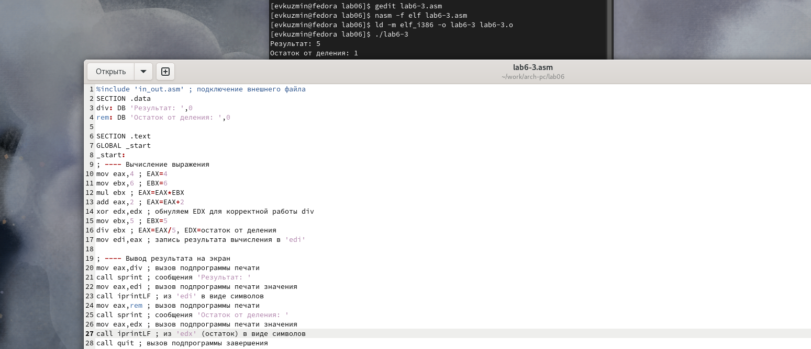{#fig:014 width=70%}
 
 Создаю файл variant.asm с помощью утилиты touch. Ввожу в файл текст программы для вычисления варианта задания по номеру студенческого билета. Провожу компиляцию и компоновку, запускаю исполняемый файл. Ввожу номер своего студенческого билета. Программа выводит, что мой вариант - 7 (рис. @fig:015).
 
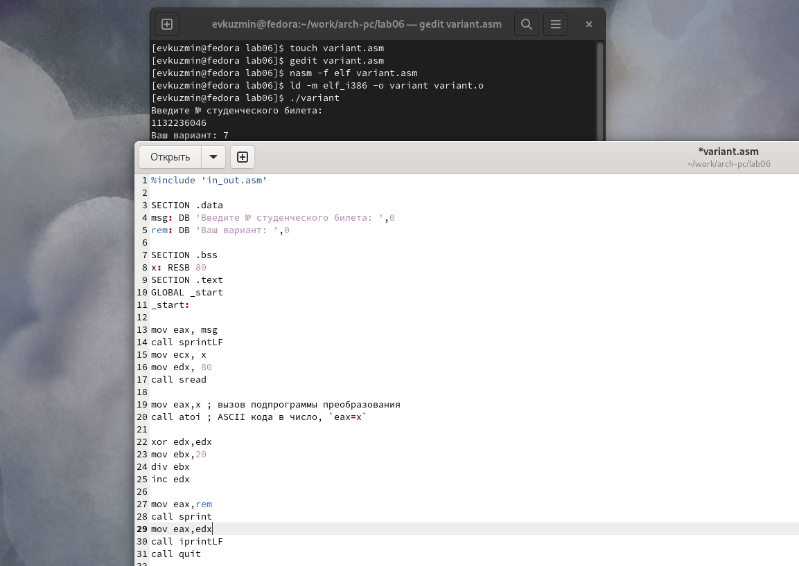{#fig:015 width=70%}

 Ответы на вопросы:
 1. За вывод сообщения "Ваш вариант" отвечают строки кода:
```mov eax,rem
call sprint
```
 2. Инструкция mov ecx,x используется, чтобы положить адрес вводимой строки x в регистр ecx mov edx. 80 - запись в регистр edx длины вводимой строки. call sread - вызов подпрограммы из внешнего файла, обеспечивающей ввод сообщения с клавиатуры.

 3. call atoi используется для вызова подпрограммы из внешнего файла, которая преобразует ascii-код символа в целое число и записывает результат в регистр eax.
 
 4. За вычисления варианта отвечают строки:
```xor edx,edx ; обнуление edx для корректной работы div
mov ebx,20
div ebx ; eax = eax/20, edx - остаток от деления
inc edx ; edx = edx + 1
```

 5. При выполнении инструкции div ebx остаток от деления записывается в регистр edx.
 
 6. Инструкция inc edx увеличивает значение регистра edx на 1
 
 7. За вывод на экран результатов вычислений отвечают строки:
```mov eax,edx
call iprintLF
```

 4.3) Выполнение заданий для самостоятельной работы
 
 Создаю файл sr.asm с помощью утилиты touch. Открываю созданный файл для редактирования, ввожу в него текст программы для вычисления значения выражения своего, 7-го варианта, 5*(x-1)^2. (рис. @fig:016)
 
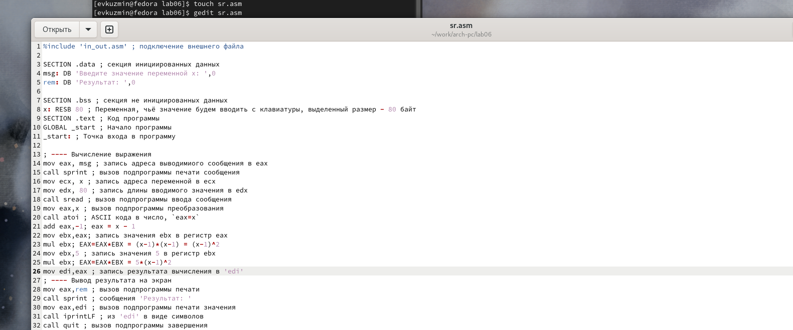{#fig:016 width=70%}

 Проводим привычные операции и запускаем исполняемый файл, выполняем устную проверку и убеждаемся в правильности работы программы.(рис. @fig:017)
 
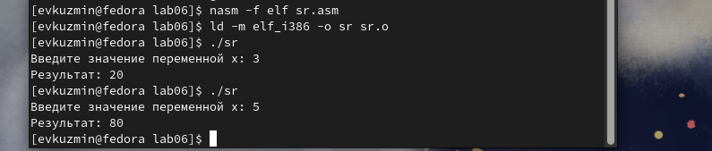{#fig:017 width=70%}

 Листинг 4.1 - Программа для вычисления значения выражения из варианта 7.
 
```%include 'in_out.asm' ; подключение внешнего файла
SECTION .data ; секция инициированных данных
msg: DB 'Введите значение переменной х: ',0
rem: DB 'Результат: ',0
SECTION .bss ; секция неинициированных данных
x: RESB 80 ; Переменная, значение которой мы будем вводить с клавиатуры, выделенный размер - 80 байт
SECTION .text ; Код программы
GLOBAL _start ; Начало программы
_start: ; Точка входа в программу
; ---- Вычисление выражения
mov eax, msg ; запись адреса выводимиого сообщения в eax
call sprint ; вызов подпрограммы печати сообщения
mov ecx, x ; запись адреса переменной в ecx
mov edx, 80 ; запись длины вводимого значения в edx
call sread ; вызов подпрограммы ввода сообщения
mov eax,x ; вызов подпрограммы преобразования
call atoi ; ASCII кода в число, `eax=x`
add eax,-1; eax = x - 1
mov ebx,eax; запись значения ebx в регистр eax
mul ebx; EAX=EAX*EBX = (x-1)*(x-1) = (x-1)^2
mov ebx,5 ; запись значения 5 в регистр ebx
mul ebx; EAX=EAX*EBX = 5*(x-1)^2
mov edi,eax ; запись результата вычисления в 'edi'
; ---- Вывод результата на экран
mov eax,rem ; вызов подпрограммы печати
call sprint ; сообщения 'Результат: '
mov eax,edi ; вызов подпрограммы печати значения
call iprintLF ; из 'edi' в виде символов
call quit ; вызов подпрограммы завершения
```

# Выводы

 При выполнении лабораторной работы я освоил арифметические инструкции языка ассемблера NASM и приобрел практический опыт работы с ними.
 
# Список литературы{.unnumbered}

[Архитектура компьютера и ЭВМ](https://esystem.rudn.ru/pluginfile.php/2089086/mod_resource/content/0/Лабораторная%20работа%20№6.%20Арифметические%20операции%20в%20NASM..pdf)

