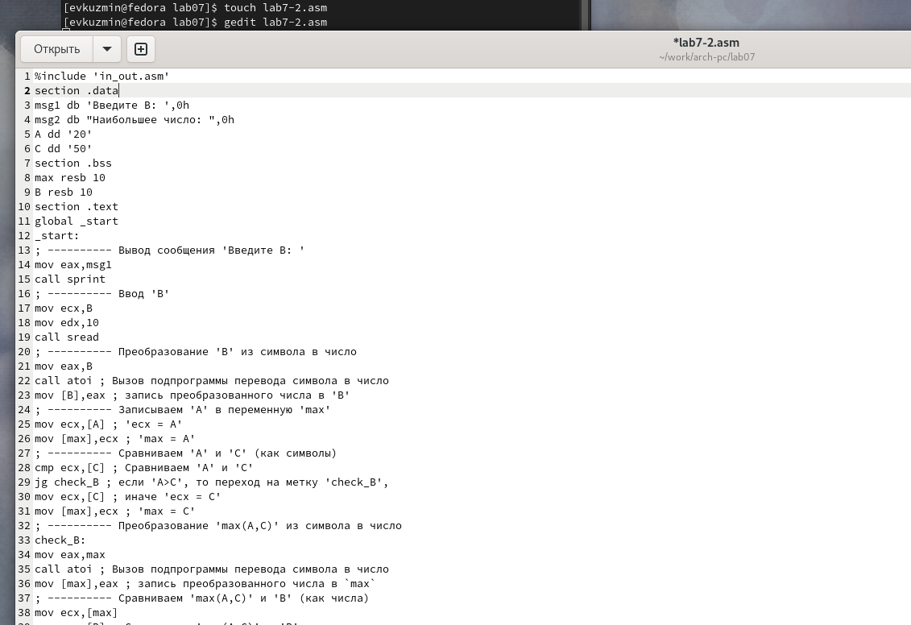

---
## Front matter
title: "Отчёт по лабораторной работе №7"
subtitle: "Дисциплина: Архитектура Компьютера"
author: "Егор Витальевич Кузьмин"

## Generic otions
lang: ru-RU
toc-title: "Содержание"

## Bibliography
bibliography: bib/cite.bib
csl: pandoc/csl/gost-r-7-0-5-2008-numeric.csl

## Pdf output format
toc: true # Table of contents
toc-depth: 2
lof: true # List of figures

fontsize: 12pt
linestretch: 1.5
papersize: a4
documentclass: scrreprt
## I18n polyglossia
polyglossia-lang:
  name: russian
  options:
	- spelling=modern
	- babelshorthands=true
polyglossia-otherlangs:
  name: english
## I18n babel
babel-lang: russian
babel-otherlangs: english
## Fonts
mainfont: PT Serif
romanfont: PT Serif
sansfont: PT Sans
monofont: PT Mono
mainfontoptions: Ligatures=TeX
romanfontoptions: Ligatures=TeX
sansfontoptions: Ligatures=TeX,Scale=MatchLowercase
monofontoptions: Scale=MatchLowercase,Scale=0.9
## Biblatex
biblatex: true
biblio-style: "gost-numeric"
biblatexoptions:
  - parentracker=true
  - backend=biber
  - hyperref=auto
  - language=auto
  - autolang=other*
  - citestyle=gost-numeric
## Pandoc-crossref LaTeX customization
figureTitle: "Рис."
tableTitle: "Таблица"
listingTitle: "Листинг"
lofTitle: "Список иллюстраций"

lolTitle: "Листинги"
## Misc options
indent: true
header-includes:
  - \usepackage{indentfirst}
  - \usepackage{float} # keep figures where there are in the text
  - \floatplacement{figure}{H} # keep figures where there are in the text
---

# Цель работы

Целью данной работы является изучение команд условного и безусловного переходов, приобретение практического опыта в написании программ с использованием переходов, знакомство с назначением и структурой файла листинга

# Задание

	0. Общее ознакомление с командами условного и безусловного переходов.
	1. Реализация переходов в NASM.
	2. Изучение структуры файла листинга.
	3. Выполнение заданий для самостоятельной работы
	
# Теоретическое введение

Для реализации ветвлений в ассемблере используются так называемые команды передачи управления или команды перехода. Можно выделить 2 типа переходов:
• условный переход – выполнение или не выполнение перехода в определенную точку программы в зависимости от проверки условия.
• безусловный переход – выполнение передачи управления в определенную точку программы без каких-либо условий.
Безусловный переход выполняется инструкцией jmp (от англ. jump – прыжок), которая включает в себя адрес перехода, куда следует передать управление. Адрес перехода может быть либо меткой, либо адресом области памяти, в которую предварительно помещен указатель перехода. Кроме того, в качестве операнда можно использовать имя регистра, в таком случае переход будет осуществляться по адресу, хранящемуся в этом регистре
Как отмечалось выше, для условного перехода необходима проверка какого-либо условия.
В ассемблере команды условного перехода вычисляют условие перехода анализируя флаги из регистра флагов. Флаг – это бит, принимающий значение 1 («флаг установлен»), если выполнено некоторое условие, и значение 0 («флаг сброшен») в противном случае. Флаги работают независимо друг от друга, и лишь для удобства они помещены в единый регистр — регистр флагов, отражающий текущее состояние процессора. 
Инструкция cmp является одной из инструкций, которая позволяет сравнить операнды и выставляет флаги в зависимости от результата сравнения. Инструкция cmp является командой сравнения двух операндов и имеет такой же формат, как и команда вычитания Мнемоника перехода связана со значением анализируемых флагов или со способом формирования этих флагов. Листинг (в рамках понятийного аппарата NASM) — это один из выходных файлов, создаваемых транслятором. Он имеет текстовый вид и нужен при отладке программы, так как кроме строк самой программы он содержит дополнительную информацию. Все ошибки и предупреждения, обнаруженные при ассемблировании, транслятор выводит на экран, и файл листинга не создаётся. Итак, структура листинга:
• номер строки — это номер строки файла листинга (нужно помнить, что номер строки в
файле листинга может не соответствовать номеру строки в файле с исходным текстом
программы);
• адрес — это смещение машинного кода от начала текущего сегмента;
• машинный код представляет собой ассемблированную исходную строку в виде шестнадцатеричной последовательности. (например, инструкция int 80h начинается по смещению 00000020 в сегменте кода; далее идёт машинный код, в который ассемблируется инструкция, то есть инструкция int 80h ассемблируется в CD80 (в шестнадцатеричном представлении); CD80 — это инструкция на машинном языке, вызывающая прерывание ядра);
исходный текст программы — это просто строка исходной программы вместе с комментариями (некоторые строки на языке ассемблера, например, строки, содержащие
только комментарии, не генерируют никакого машинного кода, и поля «смещение» и
«исходный текст программы» в таких строках отсутствуют, однако номер строки им
присваивается)

# Выполнение лабораторной работы
 
 4.1) Символьные и численные данные в NASM.
 
 С помощью утилиты mkdir создаю директорию lab07 для выполнения соответствующей лабораторной работы. Перехожу в созданный каталог с помощью утилиты cd. С помощью touch создаю файл lab7-1.asm. (рис. @fig:001).

{#fig:001 width=70%}

 Открываю созданный файл lab7-1.asm, вставляю в него следующую программу:  (рис. @fig:002).

{#fig:002 width=70%}

 Копирую в текущий каталог файл in_out.asm с помощью утилиты cp, ибо он будет использоваться в дальнейшем. Выполняю компиляцию, компоновку файла и запускаю его. Мы видим, что использование инструкции jmp _label2 меняет порядок исполнения инструкций и позволяет выполнить инструкции начиная с метки _label2, пропустив вывод первого сообщения (рис. @fig:003).
 
{#fig:003 width=70%}
 
 Добавляю в текст метки jmp_label1 jmp_end (рис. @fig:004).

{#fig:004 width=70%}
 
 Создаю новый исполняемый файл программы и запускаю его. Соответственно, инструкция jmp позволяет осуществлять переходы не только вперед но и назад. (рис. @fig:005).
 
{#fig:005 width=70%}

 Изменяю метки jmp в программе, чтобы выводились сообщения в порядке 3,2,1 (рис. @fig:006).

{#fig:006 width=70%}

 Выполняю компиляцию и компоновку, и запускаю исполняемый файл. Видим, что все работает так, как нужно.  (рис. @fig:007).
 
{#fig:007 width=70%}
 
 Создаю файл lab7-2.asm. Редактирую его, вводя предлагаемую программу. (рис. @fig:008).
 
{#fig:008 width=70%}

 Создаю исполняемый файл и проверяю его работу для разных значений В. (рис. @fig:009).
 
{#fig:009 width=70%}

 4.2) Изучение структуры файла листинга.

 Получаю файл листинга для программы lab7-2, указав ключ -l и введя имя листинга в командной строке. (рис. @fig:010).

{#fig:010 width=70%}

 Открываю полученный файл листинга в mcedit (рис. @fig:011).
 
{#fig:011 width=70%}

Объяснение строк:

  Инструкция mov ecx,B используется, чтобы положить адрес вводимой строки B в регистр ecx.
  call sread - вызов подпрограммы из внешнего файла, обеспечивающей ввод сообщения с клавиатуры.
  call atoi используется для вызова подпрограммы из внешнего файла, которая преобразует ascii-код символа в целое число и записывает результат в регистр eax.

 Открываю заново файл для редактирования и убираю один из операндов в инструкции двумя операндами. Заново создаю листинг. (рис. @fig:013).
 
{#fig:013 width=70%}

  Мы видим ошибку, но файл листинга сойдаётся. Открываю его. Также на месте строки находится сообщение об ошибке. (рис. @fig:014).
  
{#fig:014 width=70%}
 
 4.3) Выполнение заданий для самостоятельной работы
 
 Создаю файл sr-1.asm с помощью утилиты touch. Открываю созданный файл для редактирования, ввожу в него текст программы для определения наименьшего числа из 3-х, предложенных в варианте 7, полученным мною при выполнении прошлой лабораторной работы (рис. @fig:015)
 
{#fig:015 width=70%}

 Проводим привычные операции и запускаем исполняемый файл, выполняем устную проверку и убеждаемся в правильности работы программы.(рис. @fig:016)
 
{#fig:016 width=70%}

 Создаю файл sr-2.asm с помощью утилиты touch. Открываю созданный файл для редактирования, ввожу в него текст программы для своего 7-го варианта: f = 6a, если x=a и f = x+a, если x!=a (рис. @fig:016)
 
{#fig:016 width=70%}

 Компилирую, обрабатываю и конце концов запускаю исполняемый файл. Ввожу предложенные значения, и, сделав проверку, понимаю, что программа работает верно(рис. @fig:017)
 
{#fig:017 width=70%}

 Листинг 4.1 - Программа для определения наименьшего числа из 3-х, предложенных в варианте 7.
 
 
 
 
```%include 'in_out.asm'
section .data
msg2 db "Наименьшее число: ",0h
A dd '46'
B dd '67'
C dd '15'
section .bss
min resb 10
section .text
global _start
_start:
; ---------- Преобразование 'B' из символа в число
mov eax,B
call atoi ; Вызов подпрограммы перевода символа в число
mov [B],eax ; запись преобразованного числа в 'B'
; ---------- Записываем 'A' в переменную 'min'
mov ecx,[A] ; 'ecx = A'
mov [min],ecx ; 'min = A'
; ---------- Сравниваем 'A' и 'С' (как символы)
cmp ecx,[C] ; Сравниваем 'A' и 'С'
jl check_B ; если 'A<C', то переход на метку 'check_B',
mov ecx,[C] ; иначе 'ecx = C'
mov [min],ecx ; 'min = C'
; ---------- Преобразование 'min(A,C)' из символа в число
check_B:
mov eax,min
call atoi ; Вызов подпрограммы перевода символа в число
mov [min],eax ; запись преобразованного числа в `min`
; ---------- Сравниваем 'min(A,C)' и 'B' (как числа)
mov ecx,[min]
cmp ecx,[B] ; Сравниваем 'min(A,C)' и 'B'
jl fin ; если 'min(A,C)<B', то переход на 'fin',
mov ecx,[B] ; иначе 'ecx = B'
mov [min],ecx
; ---------- Вывод результата
fin:
mov eax, msg2
call sprint ; Вывод сообщения 'Наименьшее число: '
mov eax,[min]
call iprintLF ; Вывод 'min(A,B,C)'
call quit ; Выход
```

Листинг 4.2 - Программа для вычисления значения системы из варианта 7.
 
 
 
 
```%include 'in_out.asm' ; подключение внешнего файла
SECTION .data ; секция инициированных данных
msg1: DB 'Введите значение переменной х: ',0
msg2: DB 'Введите значение переменной a: ',0
rem: DB 'Результат: ',0
SECTION .bss ; секция не инициированных данных
x: RESB 80 ; Переменная, чьё значение будем вводить с клавиатуры, выделенный размер - 80 байт
a: RESB 80 ; Переменная, чьё значение будем вводить с клавиатуры, выделенный размер - 80 байт
SECTION .text ; Код программы
GLOBAL _start ; Начало программы
_start: ; Точка входа в программу
mov eax, msg1 ; запись адреса выводимиого сообщения в eax
call sprint ; вызов подпрограммы печати сообщения
mov ecx, x ; запись адреса переменной в ecx
mov edx, 80 ; запись длины вводимого значения в edx
call sread ; вызов подпрограммы ввода сообщения
mov eax,x; вызов подпрограммы преобразования
call atoi ; ASCII кода в число, `eax=x`
mov [x],eax
mov eax, msg2 ; запись адреса выводимиого сообщения в eax
call sprint ; вызов подпрограммы печати сообщения
mov ecx,a ; запись адреса переменной в ecx
mov edx, 85 ; запись длины вводимого значения в edx
call sread ; вызов подпрограммы ввода сообщения
mov eax,a ; вызов подпрограммы преобразования
call atoi ; ASCII кода в число, `eax=x`
mov [a],eax
;------------
cmp eax,[x] ; Сравниваем 'A' и 'С'
je check_B ; если 'A<C', то переход на метку 'check_B',
jne check_A
;------------
check_A:
add eax,[x]; eax = x + a
mov edi,eax ; запись результата вычисления в 'edi'
jmp _end
;------------
check_B:
mov ebx,6 ; запись значения 6 в регистр ebx
mul ebx; EAX=EAX*6
mov edi,eax ; запись результата вычисления в 'edi'
jmp _end
; ---- Вывод результата на экран
_end:
mov eax,rem ; вызов подпрограммы печати
call sprint ; сообщения 'Результат: '
mov eax,edi ; вызов подпрограммы печати значения
call iprintLF ; из 'edi' в виде символов
call quit ; вызов подпрограммы завершения
```

# Выводы

 При выполнении лабораторной работы я изучил команды условного и безусловного переходов, приобрел практический опыт в написании программ с использованием переходов, познакомился с назначением и структурой файла листинга
 
# Список литературы{.unnumbered}

[Архитектура компьютера и ЭВМ](https://esystem.rudn.ru/pluginfile.php/2089086/mod_resource/content/0/Лабораторная%20работа%20№6.%20Арифметические%20операции%20в%20NASM..pdf)

